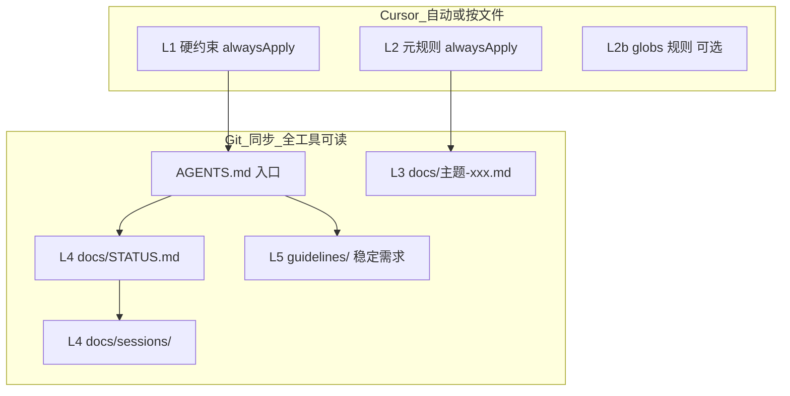

# 五层项目上下文架构

> 通用模型：任何长期维护、多 AI / 多设备协作的代码项目。

## 各层职责

| 层 | 路径 | 更新频率 | 进 AI 上下文的方式 |
|----|------|----------|-------------------|
| **L1 硬约束** | `.cursor/rules/*-gotchas.mdc` | 发现新坑时 | Cursor `alwaysApply: true` |
| **L2 元规则** | `.cursor/rules/*-conventions.mdc` | 协作约定变化时 | Cursor `alwaysApply: true` |
| **L2b 按文件** | `.cursor/rules/*.mdc` + `globs:` | 栈/目录约定 | 打开匹配文件时 |
| **L3 专题** | `docs/SUBTITLE-FORMAT.md` 等 | 该主题稳定后少改 | gotchas **一行链接** 或用户 `@` |
| **L4 活状态** | `docs/STATUS.md` | **每次收工** | 新对话必读 |
| **L4 日志** | `docs/sessions/YYYY-MM-DD.md` | 有长讨论时 | 按需读 |
| **L5 需求** | `guidelines/` | 需求变更时 | 用户 `@` 或任务涉及 |
| **入口** | `AGENTS.md` | 架构/命令变时 | 新对话第二读 |

## 不是什么

| 错误做法 | 为什么 |
|----------|--------|
| `.cursor/plans/*.plan.md` 当进度 | 不进 Git、易重复、Cursor 私有 |
| 一个 500 行 STATUS | token 浪费；细节进 sessions |
| 所有规则写 alwaysApply | 上下文膨胀；细则放 docs |
| 只靠对话记忆 | 换对话/换 agent 即丢失 |

## STATUS vs sessions

| | STATUS | sessions |
|--|--------|----------|
| 长度 | ~1 页 | 可长 |
| 内容 | 全项目模块表 + 接下来 | 当日 delta、方案、讨论 |
| 权威 | **模块状态以 STATUS 为准** | 历史细节；不重复整表 |

## AGENTS vs README

- **README**：人类 10～20 行，安装 + 链 AGENTS
- **AGENTS**：AI 入口，栈、命令、路由、文档索引、收工 ritual

## 与 project-context Skill 的关系

- **Skill**：跨项目的 bootstrap / 收工 / 开对话 **流程**
- **gotchas / conventions**：**本仓库**的事实与索引
- 迁移到新项目：跑 `scaffold.mjs` + 填 gotchas，Skill 本身可复用（个人 `~/.cursor/skills/` 或项目 `.agents/skills/`）
