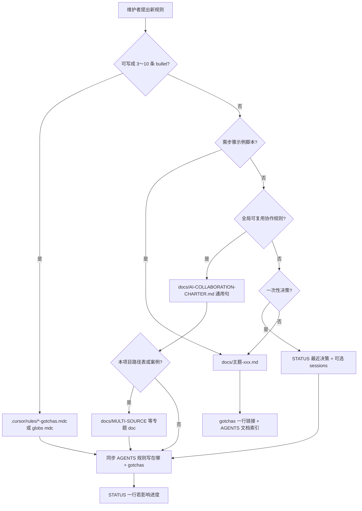

# 规则落盘决策树

> 通用流程；本项目事实填在 gotchas / AGENTS「规则写在哪」。

## 上下文注入（必记）

| 进 AI 上下文 | 方式 |
|--------------|------|
| `AGENTS.md` | 每会话（Cursor 项目规则） |
| `.cursor/rules/*.mdc` `alwaysApply: true` | 每会话自动 |
| `.cursor/rules/*.mdc` + `globs:` | 打开匹配文件时 |
| `docs/AI-COLLABORATION-CHARTER.md` | **不自动** → gotchas/AGENTS 索引 + 复杂任务时 Read |
| `docs/主题-*.md` | gotchas **一行** 或用户 `@` |
| `docs/STATUS.md` | 新对话第一读（gotchas 点名） |

**宪章-only 无索引 = AI 看不见。**

## 通用 vs 项目细则

| 内容 | 写哪 |
|------|------|
| 复杂任务四步、多源计划方法论 | 宪章（通用表述） |
| demo 优先级表、D4 式反面案例 | `MULTI-SOURCE-EXEC-PLAN.md` |
| 命令、坑点、探索/实现目录 | gotchas |
| 栈、路由、文档索引 | AGENTS |

## 探索 vs 实现目录

| 目录占位 | 用途 |
|----------|------|
| `{EXPLORE_DIR}/` | 原型、HTML demo、设计探索（不经生产构建） |
| `{APP_DIR}/` | 生产代码；迁入选型后改这里 |

新规则应标明改哪个目录，避免 demo 约束误伤 production。
