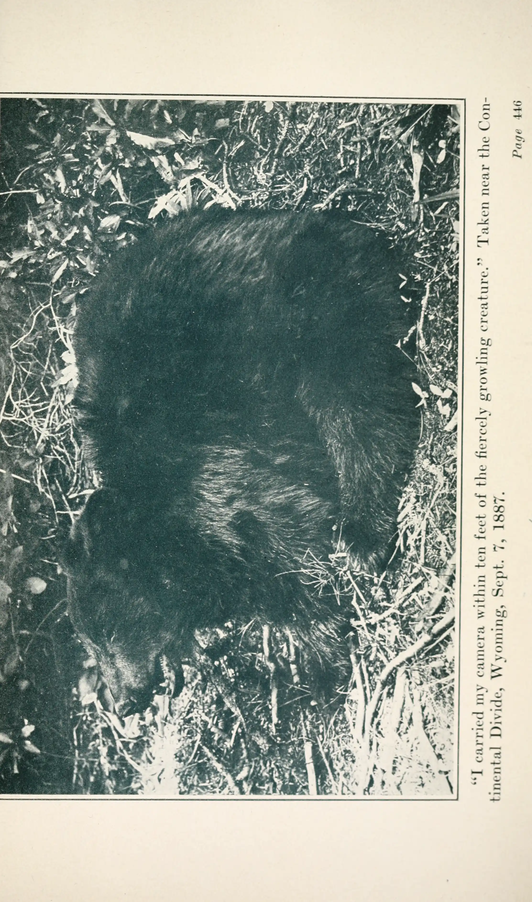

# 设计 spec — design-demos 共同输入

> **适用**：`design-demos/` 下全部 HTML 探索稿（旧三版 A/B/C + 新五版 D1–D5）。  
> **目标**：优质**案例库**——内容一致、视觉学校各异，供试吃混搭；**不是**五版里必须挑一个整页照搬。  
> **试吃笔记**：见 [docs/DEMO-TASTING-NOTES.md](../docs/DEMO-TASTING-NOTES.md)（每版记「喜欢 / 不要 / 可偷元件」）。  
> **写代码门控**：见 [docs/DEMO-BUILD-GATE.md](../docs/DEMO-BUILD-GATE.md) — **① web-design-engineer SKILL → ② DEMO-TASTING → ③ 其余**。

---

## 这是什么

廖智强 Archie 个人站的**高保真 HTML 探索稿**（桌面优先 1440px 宽，首屏按 1440×900 优化）。

- 定位：视频日记 + 网络优质内容（当前以 AI 为主）的沉淀归档
- 每版交付：**Home + List + Detail** 三视图（Tweaks 切换）+ 右下角 **Tweaks** 面板
- 迁入 `src/` React 前：**不改** `src/`；定稿后另开任务

---

## 受众 / 场景 / 目的

- 受众：B站/小红书粉丝、同频学习者、潜在合作方、作者本人
- 场景：搜某主题 / 了解作者 / 回顾某期日记
- 目的：强第一印象 + 精选/时间线入口 + 展示可复用的排版/动效/色板案例

---

## 约束分层（读这一节最重要）

硬约束曾全部堆在一处，导致五版无法拉开差异（例如强制 Playfair、强制浅纸、禁止暗色），与 [web-design-engineer](../.agents/skills/web-design-engineer/SKILL.md)「每方向独立 Design System」冲突。现拆三层：

| 层级 | 名称 | 谁必须守 | 内容 |
|------|------|----------|------|
| **A** | 环境与诚信 | **全部 demo** | loli.net 字体、本地图、真内容、反 slop、导航文案、无运行时外链图 |
| **B** | 品牌/production 默认 | **迁入 `src/` 时** + benchmark 系 demo | 暖奶油纸、文气复古、低饱和暖 accent、气质关键词 |
| **C** | 探索破例 | **单版 D1–D5** 可为展示某一 visual school **局部破 B** | 须在 HTML 顶部注释写明破例项 + `BorrowableParts`（可偷元件清单） |

**原则**：整站气质不喜欢某版 → 正常；该版仍可作为**元件库**（tooltip、列表 hover、folio 数字等）。

### A 层 — 环境与诚信（所有版本）

1. **字体经 [fonts.loli.net](https://fonts.loli.net)** 加载（勿直连 Google Fonts）。各版 **display / 正文 / UI 字体组合可不同**（按 recipe），但须走 loli.net。
2. **图片**：仅 `design-demos/assets/img/` 相对路径自托管；运行时 **禁止 hotlink** 外链图（Unsplash、CDN 图床等）。
3. **真实内容**：用下文 14 期日记与站点文案，禁止 Lorem、禁止编造数据/假 testimonial。
4. **反 AI slop**（技能默认，除非该版 school 刻意使用且注释说明）：
   - 无紫粉蓝渐变底
   - 无 emoji 当图标
   - 无 SVG 手绘人物/场景冒充摄影
   - **Display 标题**不用 Inter / Roboto / Arial / system-ui 作主视觉字
5. **单文件自包含 HTML**（单版内 Tweaks 切换视图，不为此拆多个文件）。
6. **导航**：知识图谱 · **点我点我**（hover **tooltip**「点我点我～」）· 反馈 · 关于我。
7. **无障碍友好动效**：提供 `prefers-reduced-motion` 降级；不用 `scrollIntoView`。
8. **文件头注释**须含：视觉学校名、3–5 条设计决策、关键假设；探索版另加 **`BorrowableParts:`** 列表。

### B 层 — 品牌 / production 默认（benchmark 气质）

迁入 React 或旧三版「中心方向」时默认：

- **气质**：精致、复古、清新明朗、文气、有时间感、克制、信息分明  
  参照 Claude Fable 5：**奶油纸 + 复古博物版画 + 优雅衬线**
- **纸底**：暖奶油（`#F6F0E2` / `#F5F0E8` / `#fff9e8` 一类），非冷灰纯白
- **字**：英文/数字 display 常用 **Playfair Display**；中文标题 **Noto Serif SC**；正文/UI 常用 **Inter + Noto Sans SC**（探索版可换 Lora、Source Serif 4 等，见各版注释）
- **色**：墨褐正文 + **单一低饱和暖 accent**（如 benchmark `#CC785C`、Press `#BB4C42`）
- **质感**：颗粒/网点 optional，全页 opacity **≤ 0.12**
- **明确不要**（production）：赛博霓虹、紫色渐变、性冷淡大面积空白牺牲可读性

### C 层 — 探索 demo 破例（D1–D5）

为拉开案例库差异，允许在**单版**中破 B 层，示例：

| 破例 | 允许场景 | 须注释 |
|------|----------|--------|
| 墨底 masthead / 页脚 / 列表侧栏 | Monocle、Turley 等 editorial / brutalist | 标明「仅该区块；production 可只偷 hover/tooltip」 |
| 高饱和色块 | D4 turley（ground 仍可为暖纸，色块作 contrast） | 标明 accent 策略 |
| 非 Playfair display | 各 recipe 指定字体 | Design System 声明 |
| 非「Hero 双栏」布局 | 封面 spread、海报网格、时间线主导 | 首页**信息块**仍须覆盖（见下） |

---

## 气质关键词（B 层默认）

精致、复古、清新明朗、文气、有时间感、克制、安静但信息分明。  
博物版画（昆虫/植物/鸟类/贝类等）为**品牌气质一部分**，题材不必锁死蝴蝶。

---

## 每版须覆盖的「内容块」（布局可因 school 而异）

不要求所有版都是「左文右图双栏 + 三等分卡片」。以下**信息**须能在 Tweaks 三视图中找到对应区域：

### Home

1. 顶栏：Logo 回首页 + 导航四链  
2. Hero 区：中英字标「廖智强 / Archie」+ 标语  
3. 状态带：北京时间 · Day 计数（102，自 2026-03-14）· 月历/统计（v1 可含迷你日历）  
4. 精选入口：最新 / 精选 / 热门（呈现形式可为卡、Feature spread、编号栏目等）  
5. 往期：14 期可浏览的时间线或索引  
6. 页脚：B站 / GitHub / 小红书 / 回到顶部  

### List

- 标签或期号筛选（v0 可占位，v1 宜可点）  
- 按月或时间倒序列表  
- 选中条目预览或跳转 Detail  

### Detail（demo 约定结构）

与 guidelines 中「知识卡片」表述不同，**demo 统一用**（已定调于 D1）：

1. **敲黑板** — 本期精简要点  
2. **思维导图** — 结构化展开（v1 宜可点/分级）  
3. **视频** — B 站外链或封面占位  
4. **字幕摘录** — 3–4 段样例（非全文）  

样例期：**Day94**「一个比喻讲透 AI 与人的关系」。

---

## 真实内容

### 站点

- 名称 / LOGO：廖智强 Archie（中文 + 英文字体区分）
- 标语：记录就是生命的延续 / Recording is the continuation of life
- 外链：  
  - B站 https://space.bilibili.com/24473971  
  - GitHub https://github.com/Archie-Liao  
  - 小红书 https://www.xiaohongshu.com/user/profile/5aa2acff11be10279b762ae0

### 14 期日记（数字越大越新）

| Day | 标题 | 日期 | 标签 |
|-----|------|------|------|
| 99 | 成长会自动消解很多难题 | 2026-06-05 | 人生 认知 原创 |
| 98 | 学会用筷子，却发现没菜可夹 | 2026-06-04 | AI 方法 原创 |
| 97 | 手机被忽视，AI正在重蹈覆辙 | 2026-06-03 | AI 社会 观点 |
| 96 | 信息爆炸！别怕错过优质内容 | 2026-06-02 | 认知 方法 原创 |
| 95 | 西西弗少儿区，原来我看错了 | 2026-06-01 | 随想 记录 原创 |
| 94 | 一个比喻讲透AI与人的关系 | 2026-05-31 | AI 认知 观点 |
| 93 | 踩了两个坑，总结出两大洞见 | 2026-05-30 | 复盘 方法 原创 |
| 92 | 津巴多心理学，高效记忆两大妙招 | 2026-05-29 | 认知 方法 书籍 |
| 91 | AI学知识套路居然和人类一样 | 2026-05-28 | AI 认知 原创 |
| 90 | 读书是攒经验，并非一朝挖出黄金 | 2026-05-27 | 认知 方法 原创 |
| 89 | 十周年新品！得到大脑优缺点盘点 | 2026-05-26 | AI 商业 观点 |
| 88 | 想练好表达？一定要多和真人交流 | 2026-05-25 | 自媒体 方法 原创 |
| 87 | LPL对决！涅槃组以下克上战胜登峰组 | 2026-05-24 | 随想 记录 |
| 86 | 困住创作的三条枷锁，看完豁然开朗 | 2026-05-23 | 自媒体 方法 原创 |

- 最新一期 = Day99  
- 精选推荐 = Day94  
- 热门示例 = Day99 / Day94 / Day96  

### 简介（可摘一句）

「你好，我叫廖智强。我相信人可以用另一种方式永远活着。我在为自己写一部不会完结的生命之书。每一条视频日记都是一页，每一次成长都是一章。我要把最完整的自己留给未来的世界。这是我一个人走了很久的远征，但是我永远期待能在路上遇见，同样仰望星空的你，终身学习，与君共勉，期待与你的相遇。」

---

## 素材规范

### 气质

19–20 世纪自然史 / 植物学 / 鸟类学版画、石印、手工上色；克制、文气、低饱和。与 demo 整体纸色协调即可（探索版若用深底，选对比度足够的图版）。

### 许可（必须满足其一）

- Public Domain（含过期版权古籍扫描）
- CC0 / 博物馆 **Open Access** 明确可下载
- Wikimedia Commons 文件页标注 PD 或 compatible license

**禁止**：未标许可的馆图、现代摄影图库、水印图、凭猜测当公版。

### 推荐来源（人工浏览为主）

| 层级 | 来源 | 说明 |
|------|------|------|
| A | [BHL](https://www.biodiversitylibrary.org/) | 书目翻页存 `pageimage`，稳定 |
| B | [Wikimedia Commons](https://commons.wikimedia.org/) | **文件页 → Original file**；禁止手猜 `upload.wikimedia.org` 路径 |
| C | 博物馆 OA | Met、Smithsonian、Rijksmuseum、Wellcome 等标 OA/PD 条目 |
| D | [Europeana](https://www.europeana.eu/) | 筛选 Public Domain |
| E | [Internet Archive](https://archive.org/) | BHL 镜像；网络不稳时不阻塞交付 |

**不推荐**：Unsplash/Pexels（画风不符）、运行时 hotlink。

> 扩展书目与检索技巧见 Cursor plan「五版 design-demos」§二素材手册；**活清单**见 [assets/img/README.md](assets/img/README.md)。

### 入库流程

1. 保存到 `design-demos/assets/img/`，语义化文件名（`bhl_` / `botanical_` / `engraving_` 等前缀）
2. **MD5 去重**；禁止 `Copy-Item` 复制别名冒充新图
3. 单张建议 **≥ 15KB**（过小多为错误页；透明 PNG 可酌情例外）
4. 在 **`assets/img/README.md`** 登记：文件名 · 来源 · 原页 URL · 许可

### 谁负责下载

| 角色 | 做法 |
|------|------|
| **用户（推荐）** | 按上表挑选下载；质量与题材可控 |
| **AI** | 可尝试单张校验入库；**失败须单独告知**（代理/手动），禁止静默交付重复图或空图 |
| **脚本** | `assets/img/_fetch-new.ps1`、`_fetch-batch2.ps1` 为**可选辅助**，非交付前置；脚本报错不阻塞 demo |

### HTML 引用示例

```html

```

---

## Tweaks 面板（每版至少）

- 视图：Home / List / Detail  
- 1 项密度或 accent 相关参数  
- 1 项创意参数（按 school，如颗粒强度、色块强度）  
- 关闭时完全隐藏，不影响「成品感」截图  

---

## 输出与自检

- 文件：`design-demos/<版本名>.html`  
- 对比入口：[design-demos/index.html](index.html)（八版索引）  

**交付前自检（A 层必过）**

- [ ] 已按 [DEMO-BUILD-GATE.md](../docs/DEMO-BUILD-GATE.md) **§3 五块**落盘 sessions + Archie Checkpoint 1  
- [ ] fonts.loli.net · 本地图 · 真 14 期内容 · 三视图可切换  
- [ ] 导航「点我点我」+ tooltip  
- [ ] 无紫渐变 / emoji 图标 / display 用 Inter  
- [ ] console 无报错；`prefers-reduced-motion` 已考虑  

**B 层**：仅当该 demo 定位为 production 候选（如 benchmark）时全过。  
**C 层**：探索版破例已在 HTML 注释列出，且 `BorrowableParts` 不少于 3 条。

---

## 与 guidelines 的差异说明（勿混读）

| 主题 | guidelines | design-demos |
|------|------------|--------------|
| 详情块 | AI 总结 → **知识卡片** | **敲黑板 → 思维导图**（demo 定调，选定后迁入 `src/` 时再统一） |
| 范围 | 全站产品需求 | 视觉探索 + 案例库 |
| 气质 | 暖纸复古 | B 层默认；C 层允许为对比而破例 |

guidelines **少改**；产品定稿时以 sessions + STATUS 决策为准。
