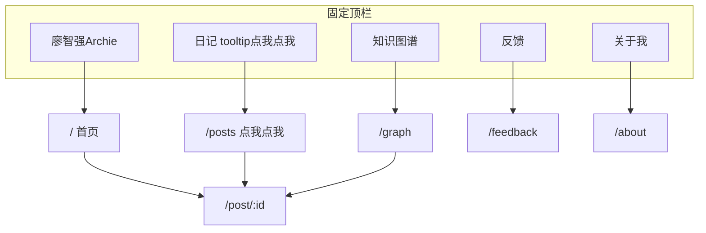

## 修订记录（最新在上）

| 北京时间 | 变更 |
|----------|------|
| 2026-06-30 14:37:56 | 文首加 YAML + **可能过时**声明；现行布局/视觉以 SITE-MANUAL、STATUS、DEMO-TASTING 为准 |

> **⚠️ 本文可能过时** — 早期改版计划副本。  
> **网站现在长什么样** → [docs/SITE-MANUAL.md](../docs/SITE-MANUAL.md)  
> **做到哪 / 最近决策** → [docs/STATUS.md](../docs/STATUS.md)  
> **demo 试吃与视觉** → [docs/DEMO-TASTING-NOTES.md](../docs/DEMO-TASTING-NOTES.md)  
> 仅当 Archie 明确要求「更新需求文档」时再改正文。

# 廖智强 Archie 个人网站 — 改版实施计划

> 本文档为改版计划的项目内副本，与 Cursor 计划同步。  
> 相关文档：[网站需求填空.md](./网站需求填空.md) · [网站设计需求模版.md](./网站设计需求模版.md)

---

## 已确认需求（锁定）

| 项 | 决定 |
|----|------|
| 参考图 | [`D:\Archie-workfiles\personal-website\reference`](D:\Archie-workfiles\personal-website\reference) 内 图1～7 + `参考图就得在外网找！！！.jpg` |
| 首页 Hero | **方案 C**：花鸟/typography 占位，**预留头像插槽**（后期换图4.png 或九宫格） |
| 详情页顺序 | AI 总结 → 知识卡片（点击展开）→ 视频 → 时间轴字幕 |
| 导航 | 固定顶栏；Logo「廖智强Archie」+ 呼吸动效；右侧：知识图谱、日记（tooltip「点我点我～」）、反馈、关于我 |
| 标签 | 沿用 knowledge_skills_DeepSeek_v0 固定标签，每篇 1～4 个 |
| 首页第二屏 | 真实北京时间 + **本地假统计/日历**（localStorage） |
| Day 计数 | 以**第一期发布日期**为 Day 1，自动计算「第 X 天」 |
| 反馈页 | 参考图3.png；第一期 **UI + localStorage**，不接后端 |
| 合作联系 | 微信二维码占位（可替换） |
| 内容更新 | **方案 C：AI 半自动**（TXT/链接 → AI 生成 Markdown → 构建发布）；后期可换 CMS |
| 外链 | [B站](https://space.bilibili.com/24473971) · [GitHub](https://github.com/Archie-Liao) · [小红书](https://www.xiaohongshu.com/user/profile/5aa2acff11be10279b762ae0) |
| 视觉参考 | [huasheng.ai](https://www.huasheng.ai/) · [mmh1.top](https://mmh1.top/) · [AI HOT](https://aihot.virxact.com/all) · 图5/6/7 Fable 复古花鸟点缀（克制使用） |
| 第二期 | 番茄钟、真实统计、CMS、人生阶段 9 张照片 |

---

## 关于「两种内容类型是否一样」

**页面上可以一样，数据里需要区分来源。**

统一为「内容条目」，详情页共用同一套布局（总结 → 卡片 → 媒体区 → 原文），差异只在字段：

```typescript
interface ContentItem {
  id: string;
  type: "video" | "link" | "note";  // 视频日记 / 外链收藏 / 图文笔记
  title: string;
  date: string;
  tags: string[];                   // 固定标签体系，1～4 个
  episode?: number;                 // 视频日记期号
  bvid?: string;                    // 有则显示 B 站播放器
  sourceUrl?: string;               // 外链原文
  coverUrl?: string;
  screenshots?: string[];           // 收藏截图
  aiSummary: { overview; keyPoints; quote };
  knowledgeCards: [...];
  subtitles?: [...];                // 视频才有
}
```

- **视频日记**：有 `bvid` + `subtitles`（来自 TXT 字幕稿）
- **外链收藏**：有 `sourceUrl` / `screenshots`，媒体区显示链接卡片或截图，无播放器

第一期数据结构按此设计，mock 数据各做 2～3 条样本即可；确认效果后再批量导入 100+ TXT。

---

## 技术栈说明（给小白）

> 这一节解释「网站是用什么搭的、为什么这样选、你需不需要学」。**你不需要会写代码也能看懂大意。**

### 一句话总结

你的个人网站 = **React 做页面积木** + **Vite 做开发/打包工具** + **Tailwind 做样式** + **Markdown 文件存内容**。  
Figma Make 导出时就是这套；改版在现有项目上改，**不推倒重来**。

### 技术栈全景（各自干什么）

| 名字 | 类型 | 干什么 | 你需要关心吗 |
|------|------|--------|-------------|
| **React** | UI 库 | 把页面拆成可复用组件（导航、卡片、图谱…） | 不用学，知道「改版 = 改组件」即可 |
| **Vite** | 构建工具 | `npm run dev` 本地预览；`npm run build` 打包成可部署文件 | 只需会跑这两个命令 |
| **TypeScript (.tsx)** | 语言 | 带类型检查的 JavaScript，减少低级错误 | 不用学，AI/开发者写 |
| **React Router** | 路由 | 管理 URL：`/` 首页、`/posts` 列表、`/post/ep047` 详情… | 对应你规划的页面结构 |
| **Tailwind CSS** | 样式 | 用 class 名快速写布局、间距、颜色 | 不用学，体现在视觉改版里 |
| **Markdown + Frontmatter** | 内容格式 | 每期日记一个 `.md` 文件，头部 YAML 写期号/标签/BV 号 | **你以后更新内容主要接触这个** |
| **localStorage** | 浏览器存储 | 反馈记录、浏览日历等「仅本机可见」的数据 | 第一期反馈/假统计用这个 |
| **node_modules** | 依赖目录 | 第三方库安装位置（在 D 盘项目里） | 不用手动改 |

**类比**：React = 乐高积木；Vite = 工作台；Markdown = 你的日记本；Tailwind = 油漆和尺子。

### 为什么选 Vite + React（而不是别的）

**不是因为它是唯一正确答案，而是对你当前阶段性价比最高。**

1. **项目已有这套代码** — 换框架 ≈ 大部分重写，周期和 bug 风险都上去  
2. **你的需求偏「应用型」** — 知识图谱拖拽、Logo 动效、标签筛选、本地日历，React 生态最成熟  
3. **开发协作友好** — 改一行代码浏览器立刻更新，适合你和 AI 反复调 UI  
4. **和内容方案 C 不冲突** — 内容可以是 Markdown 静态文件；网站可以是交互式前端，**两者并存**  
5. **部署仍然便宜** — 打包后是纯静态文件，可放 Vercel / Netlify / GitHub Pages，不必自建服务器

### 常见替代方案对比

| 方案 | 适合什么 | 优点 | 为什么现在不换 |
|------|---------|------|---------------|
| **Vite + React**（当前） | 交互丰富的个人站 | 快、生态大、现有代码可复用 | — |
| **Next.js** | 强 SEO、服务端 API、登录后台 | 功能全、部署成熟 | 学习成本高；迁移现有代码有成本 |
| **Astro** | 以阅读为主的内容站 | Markdown 友好、极快 | 知识图谱等复杂交互不如 React 顺手 |
| **Vue + Vite** | 与 React 类似 | 也好用 | 语法不同，需全部重写，无收益 |
| **Hugo / Jekyll** | 纯静态博客 | 最简单最便宜 | 难做图谱、动效、筛选 |
| **WordPress** | 网页里点按钮发文章 | CMS 成熟 | 和现有代码无关；PHP 栈，定制成本高 |

**什么时候才值得考虑 Next.js？** 非常在意搜索引擎收录、要做用户登录、要服务端 API — **第二期以后**再评估。

### 静态网站 vs 动态网站（结合你的情况）

| | 静态（本方案） | 动态（如 WordPress + 数据库） |
|--|--------------|------------------------------|
| **内容存在哪** | 项目里的 Markdown / JSON 文件 | 数据库 |
| **怎么更新** | 改文件 → 重新 build / 部署 | 登录后台点发布 |
| **100+ 期视频日记** | 完全够用（100 个 md 文件） | 也可以，但搭建更重 |
| **像 B 站一样网页上传** | 第一期不做；第二期可加 CMS | 原生支持，但要维护服务器 |
| **知识图谱 / 动效** | 前端 JS 实现，无需数据库 | 同样可以做，但更重 |

**本方案选择**：网站本身是「静态部署的前端应用」，内容是「Markdown 文件驱动」；第一期反馈/浏览统计用 localStorage，**不搭数据库**。

### 内容更新方案 C（和框架的关系）

```
你提供 TXT 字幕 + BV 号 + 标题
        ↓
    AI 生成 Markdown 文件
        ↓
    你审一眼确认
        ↓
  npm run build（Vite 打包）
        ↓
    部署 → 网站更新
```

- **你不需要懂 React** 也能更新内容，只要会（或让 AI）编辑 Markdown  
- 若以后方案 C 不顺手，可以换成 CMS，**不必换 React**  
- 若以后要强「网页点按钮发布」，在 React 项目外挂 Decap CMS / Sanity 等即可

### 你的需求 vs 技术栈匹配

```
需求                          Vite + React 是否合适
────────────────────────────────────────────────
浅色复古改版、多页面               ✅
知识图谱（拖拽/缩放）              ✅
首页时钟 + 本地假统计              ✅
AI 半自动 Markdown 更新           ✅
100+ 期内容                      ✅
第二期番茄钟 / 真实 CMS           ✅ 可渐进添加
```

### 你需要会什么 / 不需要会什么

**不需要会**：React 语法、TypeScript、Tailwind、图谱算法  

**建议了解（够用即可）**：
- `npm run dev` — 本地看效果  
- `npm run build` — 检查能否打包  
- Markdown 文件长什么样 — 方便以后审 AI 生成的内容  
- `site.config.ts` — 改外链、头像模式、Day 1 日期等配置（改版时会建）

**交给 AI / 开发者做的**：改组件、调样式、加页面、写导入脚本、部署配置

### 部署后网站跑在哪（和框架无关）

改版完成后，典型路径：

1. 代码推送到 GitHub（可选）  
2. 连接 Vercel / Netlify 免费托管  
3. 绑定域名（可选）  
4. 访客浏览器加载的是打包后的 HTML/JS/CSS — **不需要你的电脑一直开着**

---

## 为什么继续用 Vite + React — 决策结论

**当前项目已是 Vite + React**，改版在此基础进行，无需重来。  
你的需求（图谱、动效、多页面、后期可能 CMS）→ **继续 Vite + React 最省时间**。若未来要强 SEO 或服务端 API，再迁 Next.js 不迟。

---

## 站点地图



---

## 分页面设计要点

### 首页 `/` — 参考图1.png

- **左**：中英文混排 Hero（大标题「廖智强Archie」、副标题「记录就是生命的延续」）；衬线标题 + 无衬线正文，**小字必须可读**
- **右**：花鸟/typography 装饰区 + **`avatarSlot` 占位**（config 切换 `illustration | photo`）
- **第二屏上**：窄条 — 左北京时间 | 中「视频日记 · 第 X 天」| 右迷你日历（localStorage 浏览记录）
- **第二屏下**：左→右 3 卡 — 最新一期 / 精选 / 本周热门（热门可先按 mock 点击数）
- **底部**：B站 · GitHub · 小红书 · 回到顶部

### 日记列表 `/posts` — 参考图2.png + AI HOT /all

- 页头标题 + 一句话介绍
- 标签筛选 pill（固定标签体系）
- 「精选」区块 + 时间线列表（时间 | 标题 | 摘要 | 标签 | 类型图标）
- 首页「查看更多」跳转至此

### 详情 `/post/:id` — 参考 AI HOT 条目展开样式

- 返回 + 期号/日期/标签
- **长页滚动**：AI 总结 → 知识卡片（accordion 展开）→ B 站 iframe（无 bvid 则显示外链/截图）→ 时间轴字幕

### 知识图谱 `/graph`

- 力导向图（如 react-force-graph 或 d3-force）
- 节点 = 文章；边 = **标签共现** + 标题/摘要 **关键词相似度**（简单 TF-IDF 或 tag overlap）
- 悬停标题、点击跳详情；缩放/平移/拖节点；适配浅色主题

### 反馈 `/feedback` — 参考图3.png

- 多行输入 + 选填联系方式；提交 → toast + 写入 localStorage

### 关于 `/about`

- 自我介绍文案 + 合作联系（微信 QR 占位）
- 人生阶段区：第一期 typography/花鸟占位网格（预留 9 宫格插槽）

---

## 视觉系统（专业判断）

- **背景**：暖奶油白 `#F7F3ED`（参考图7），非冷灰
- **文字**：标题 Noto Serif SC / DM Serif Display；正文 Noto Sans SC 16px，行高 1.7
- **主色**：低饱和墨绿或赭石（从图5/6 蝴蝶色提取），**避免高饱和 UI**
- **装饰**：section 分隔线、角落花鸟 SVG（opacity 8～12%），**不在正文区铺花纹**
- **深浅色**：默认浅色；保留 CSS 变量结构便于后期 dark toggle

---

## 内容工程（AI 半自动，方案 C）

```
content/posts/ep047.md          ← 每期一个文件
content/posts/ep047.subtitles.txt  ← 可选，或合并在 md 里
public/assets/covers/...
```

**Frontmatter 模板**（与 knowledge skill 对齐）：

```yaml
---
id: ep047
type: video
episode: 47
title: "..."
date: 2024-06-15
tags: [AI, 方法]
bvid: BV1xx...
cover: /assets/covers/ep047.jpg
---
```

**工作流（后期）**：
1. 把 TXT 字幕 + BV 号 + 标题/日期发给 AI
2. AI 生成 `.md`（含 summary、卡片、字幕 YAML）
3. 审一眼 → `npm run build` 或 push 触发部署

第一期：新建 `content/` 目录，写 5～8 条 mock（含 2 条 `type: link` 样本），参考 AI HOT 条目文案风格。

---

## 主要改动文件

| 文件 | 改动 |
|------|------|
| `src/styles/theme.css` | 浅色复古配色、字体变量 |
| `src/app/components/Layout.tsx` | 新导航、Logo 动效、tooltip |
| `src/app/pages/HomePage.tsx` | 图1 双栏 Hero + 第二屏 |
| 新建 `PostsListPage.tsx` | 图2 列表 + 筛选 |
| `src/app/pages/PostPage.tsx` | 长页滚动，去 Tab |
| 新建 `GraphPage.tsx` | 知识图谱 |
| 新建 `FeedbackPage.tsx` | 图3 反馈 |
| `src/app/pages/AboutPage.tsx` | 新文案 + QR 占位 |
| `src/app/App.tsx` | 新路由 |
| `src/app/data/` | 内容模型 + mock / Markdown 加载 |
| `public/assets/` | 花鸟 SVG、占位 QR |
| 新建 `site.config.ts` | 外链、头像模式、Day1 日期等可替换项 |

---

## 实施分期

### 第一期（本次改版）

1. 视觉主题 + Layout/导航
2. 首页 + 列表页 + 详情长页
3. 关于 + 反馈（localStorage）
4. 知识图谱 v1（标签共现 + 简单相似度）
5. Mock 内容 5～8 条 + 占位素材
6. 头像/九宫格/QR **可配置替换点**（site.config.ts）

### 第二期

- 批量导入 100+ TXT（脚本 + AI 生成 md）
- 人生 9 张照片、真实微信 QR
- 番茄钟、Formspree/真实反馈、CMS 可选

---

## 仍需后期提供（不阻塞第一期）

- 第一期视频的真实发布日期（用于 Day 1；mock 期先用 mock 日期）
- 100+ TXT 字幕目录路径（导入时用）
- 真实微信 QR 图片（替换占位）
- 人生阶段 9 张照片（替换 about 占位）

---

## 实施任务清单

- [ ] 浅色复古 theme.css + Layout 导航/Logo 动效/tooltip
- [ ] 首页 Hero（花鸟占位+avatarSlot）+ 第二屏时钟/Day计数/本地日历 + 三卡入口
- [ ] 新建 /posts 列表页：标签筛选 + 时间线（参考图2/AI HOT）
- [ ] 详情页改为长页：AI总结→卡片展开→视频→字幕
- [ ] 知识图谱页：力导向 + 标签共现/similarity 连边
- [ ] 反馈页 localStorage + 关于页文案/QR占位/九宫格插槽
- [ ] 统一 ContentItem 模型 + 5～8 条 mock（含 video/link 样本）
- [ ] site.config.ts 集中管理外链、头像模式、Day1 日期等
